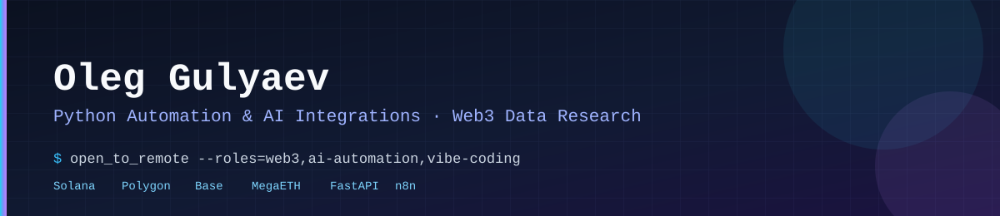

# Oleg Gulyaev

**AI Product Builder · AI-assisted Development · Automation & Integrations**

I turn product ideas into testable AI-assisted applications, using Codex and other AI agents for implementation. I focus on defining requirements, acceptance criteria, user scenarios, product boundaries, and reproducible quality checks.

**Moscow, Russia (UTC+3) · 100% remote · Full-time, part-time or project-based work**

[Резюме на русском](RESUME_RU.md) · [English resume](RESUME.md) · [Telegram](https://t.me/Olejo29) · [Email](mailto:gulaevoleg191@gmail.com) · [LinkedIn](https://www.linkedin.com/in/oleg-gulyaev-939186238/)

## Featured AI products

| Project | My role and current evidence |
|---|---|
| **[PERVOSLOVO / ПЕРВОСЛОВО](https://github.com/OlegonZo/pervoslovo)** *(private, pre-alpha)* | Product owner for an Orthodox AI companion with evidence-linked claims, controlled user memory, Clerk-based private access, and DeepSeek/OpenAI LLM integration. A live audit covered **90 dialogues / 700 turns** and identified **16 systemic defect categories**; post-fix live acceptance is still pending. |
| **[AI Fitness Coach PRO](https://github.com/OlegonZo/ai-fitness-coach)** *(research prototype)* | Product owner and fitness-domain expert guiding a computer-vision pipeline for squat video analysis, pose and motion observables, working-set identification, and tracking experiments. **Not yet a released fitness product.** Public main README reflects an earlier phase of development. |

**Private code note:** PERVOSLOVO is not a public repository. A limited demo or technical review can be discussed by arrangement; the project name and capabilities are not a claim of a public product launch.

## Other automation and engineering prototypes

| Project | Scope and limitation |
|---|---|
| [AI Document Review Pipeline](https://github.com/OlegonZo/ai-document-review-pipeline) | FastAPI webhook → deterministic rules → SQLite decision records; n8n workflow example and unit tests. Synthetic demo, no production customer integration. |
| [BotOps Control Center](https://github.com/OlegonZo/botops-control-center) | Deployed TypeScript/React operations dashboard, API status endpoints and recovery runbooks, optional OpenAI Responses integration. Demo telemetry. |
| [Exchange Monitoring Lab](https://github.com/OlegonZo/exchange-monitoring-lab) | Paper-only data normalization and deterministic research-state logic with tests and CI. No live trading. |
| [AI Creator Scout](https://github.com/OlegonZo/ld-latte-ai-test) | Profile-list normalization and human-review scoring prototype; no Instagram Direct integration. |
| [Solana Memecoin Analyzer](https://github.com/OlegonZo/solana-memecoin-analyzer) | Explainable synthetic-data scoring with risk filters; no live orders. |
| [Polymarket BTC Research](https://github.com/OlegonZo/polymarket-btc-bot) | Logged research and data-quality evaluation, including a negative hypothesis result; no claimed profitability. |

## How I work

1. Define the target user, workflows, scope, risks, and acceptance criteria.
2. Coordinate implementation with AI coding agents and compare technical approaches.
3. Verify outcomes through user scenarios, tests, structured diagnostics, logs, and independent AI-assisted reviews.
4. Fix recurring issues by root cause with regression checks; distinguish offline PASS from real-world readiness.
5. Document what is proven, what is experimental, and what remains unfinished.

**Technologies in AI-assisted projects:** Python · FastAPI · REST APIs · SQLite · n8n · TypeScript · React · Git/GitHub · GitHub Actions · pytest · Playwright · OpenAI / DeepSeek APIs · Railway · Clerk · MediaPipe · PyAV.

AI systems generate and modify much of the implementation. My role is product definition, coordination and evidence-based acceptance, **not a claim of independent manual Python coding proficiency**.

## Domain expertise

**16 years of fitness coaching experience**, applied directly to the design and evaluation of AI Fitness Coach PRO. Especially interested in FitnessTech, HealthTech, AI workflow automation and rapid MVP development.

## Education & languages

Saratov State Agrarian University — higher education, Engineer in Land Cadastre. Russian — native; English — technical reading with translation tools, spoken and written communication in development.

## Contact

[Telegram @Olejo29](https://t.me/Olejo29) · [Email](mailto:gulaevoleg191@gmail.com)

---

*Portfolio projects are described at their actual stage. I do not claim customer deployments, commercial ROI, verified trading profitability or final product quality where these have not been established.*
